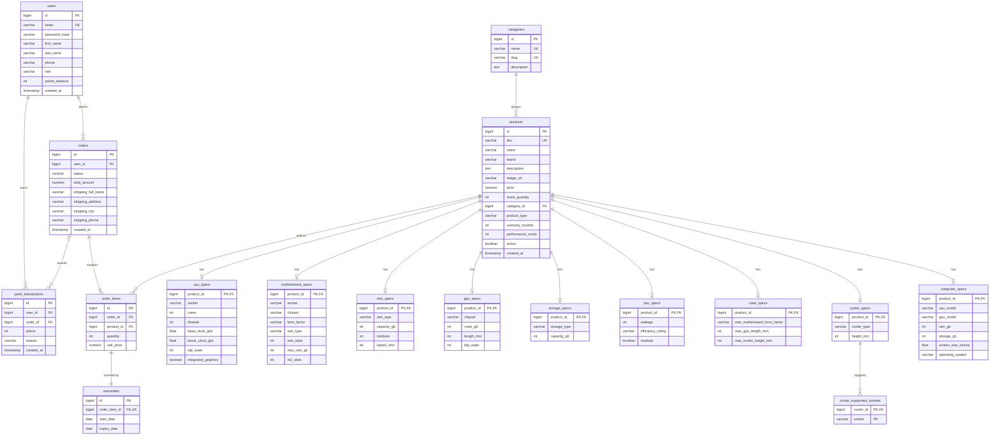

# FutureTech ERD

Source of truth: `backend/src/main/resources/db/migration/V1__create_schema.sql`.
GitHub and VS Code (with a Mermaid extension) render this diagram.

```mermaid
erDiagram
    users ||--o{ orders : places
    users ||--o{ point_transactions : earns
    orders |o--o{ point_transactions : "awards"
    orders ||--|{ order_items : contains
    products ||--o{ order_items : "sold as"
    order_items ||--|| warranties : "covered by"
    categories ||--o{ products : groups

    products ||--o| cpu_specs : has
    products ||--o| motherboard_specs : has
    products ||--o| ram_specs : has
    products ||--o| gpu_specs : has
    products ||--o| storage_specs : has
    products ||--o| psu_specs : has
    products ||--o| case_specs : has
    products ||--o| cooler_specs : has
    products ||--o| computer_specs : has
    cooler_specs ||--o{ cooler_supported_sockets : supports

    users {
        bigint id PK
        varchar email UK
        varchar password_hash
        varchar first_name
        varchar last_name
        varchar phone
        varchar role
        int points_balance
        timestamp created_at
    }
    categories {
        bigint id PK
        varchar name UK
        varchar slug UK
        text description
    }
    products {
        bigint id PK
        varchar sku UK
        varchar name
        varchar brand
        text description
        varchar image_url
        numeric price
        int stock_quantity
        bigint category_id FK
        varchar product_type
        int warranty_months
        int performance_score
        boolean active
        timestamp created_at
    }
    cpu_specs {
        bigint product_id PK,FK
        varchar socket
        int cores
        int threads
        float base_clock_ghz
        float boost_clock_ghz
        int tdp_watts
        boolean integrated_graphics
    }
    motherboard_specs {
        bigint product_id PK,FK
        varchar socket
        varchar chipset
        varchar form_factor
        varchar ram_type
        int ram_slots
        int max_ram_gb
        int m2_slots
    }
    ram_specs {
        bigint product_id PK,FK
        varchar ram_type
        int capacity_gb
        int modules
        int speed_mhz
    }
    gpu_specs {
        bigint product_id PK,FK
        varchar chipset
        int vram_gb
        int length_mm
        int tdp_watts
    }
    storage_specs {
        bigint product_id PK,FK
        varchar storage_type
        int capacity_gb
    }
    psu_specs {
        bigint product_id PK,FK
        int wattage
        varchar efficiency_rating
        boolean modular
    }
    case_specs {
        bigint product_id PK,FK
        varchar max_motherboard_form_factor
        int max_gpu_length_mm
        int max_cooler_height_mm
    }
    cooler_specs {
        bigint product_id PK,FK
        varchar cooler_type
        int height_mm
    }
    cooler_supported_sockets {
        bigint cooler_id PK,FK
        varchar socket PK
    }
    computer_specs {
        bigint product_id PK,FK
        varchar cpu_model
        varchar gpu_model
        int ram_gb
        int storage_gb
        float screen_size_inches
        varchar operating_system
    }
    orders {
        bigint id PK
        bigint user_id FK
        varchar status
        numeric total_amount
        varchar shipping_full_name
        varchar shipping_address
        varchar shipping_city
        varchar shipping_phone
        timestamp created_at
    }
    order_items {
        bigint id PK
        bigint order_id FK
        bigint product_id FK
        int quantity
        numeric unit_price
    }
    warranties {
        bigint id PK
        bigint order_item_id FK,UK
        date start_date
        date expiry_date
    }
    point_transactions {
        bigint id PK
        bigint user_id FK
        bigint order_id FK
        int points
        varchar reason
        timestamp created_at
    }
```
